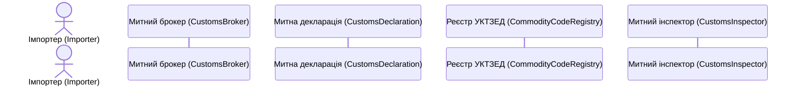

# Контракт інтерфейсу: Діаграма послідовності (`docs/sequence.mmd`)

**Feature**: `001-uml-domain-model` | **Цільовий артефакт**: `docs/sequence.mmd`  
**Формат**: Mermaid (`sequenceDiagram`) | **Кодування**: UTF-8 (без BOM)

---

## 1. Загальні вимоги до синтаксису Mermaid

1. Файл починається з ключового слова `sequenceDiagram`.
2. Вмикається наскрізна нумерація повідомлень директивою `autonumber`.
3. Усі лінії життя (lifelines) оголошуються на початку файлу з читабельними підписами українською та англійськими аліасами, що відповідають класам із `docs/class.mmd`.
4. Використовуються блоки фокусу керування (`activate` та `deactivate`).
5. Пунктирні стрілки (`-->>`) застосовуються виключно для повернення результатів виклику або асинхронних відповідей.
6. Блоки альтернатив (`alt ... else ... end`) та опціональних дій (`opt ... end`) моделюють відгалуження (валідація документів, застосування знижки, вибір форми митного контролю).

---

## 2. Учасники діаграми (Lifelines)

---

## 3. Специфікація викликів повідомлень (відповідність `docs/class.mmd`)

Кожне повідомлення у діаграмі послідовності повинно відповідати публічній сигнатурі методу відповідного класу:

1. `Imp ->> Brk: submitDocuments(broker, pkg)`
2. `Brk ->> Brk: processDocumentPackage(pkg)`
3. `Brk ->> Dec: createDeclaration(importer, pkg)`
4. `Brk ->> Reg: validateCodeFormat(commodityCode)`
5. `Reg -->> Brk: return isValid (boolean)`
6. `Brk ->> Reg: getTariffRate(commodityCode)`
7. `Reg -->> Brk: return tariffRate (double)`
8. `Brk ->> Dec: calculateDuties(rate)` або `calculateDuties(rate, discount)`
9. `Dec -->> Brk: return totalDuty (double)`
10. `Brk ->> Insp: submitDeclaration(inspector, declaration)`
11. `Insp ->> Insp: verifyDocuments(declaration)`
12. `Insp ->> Insp: assignInspection(declaration)`
13. `Insp -->> Brk: notifyInspectionDecision(formOfControl)`
14. `Brk ->> Dec: markDutiesPaid()`
15. `Insp ->> Dec: updateStatus("CargoReleased")`
16. `Insp ->> Insp: releaseCargo(declaration)`
17. `Insp -->> Brk: notifyCargoReleased(declarationNumber)`
18. `Brk -->> Imp: notifyReleaseComplete(status)`
