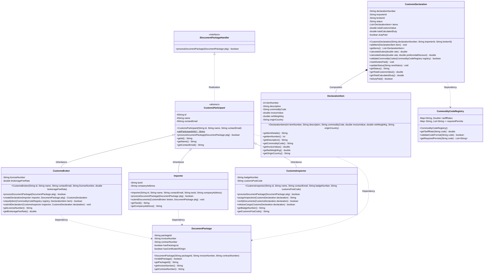
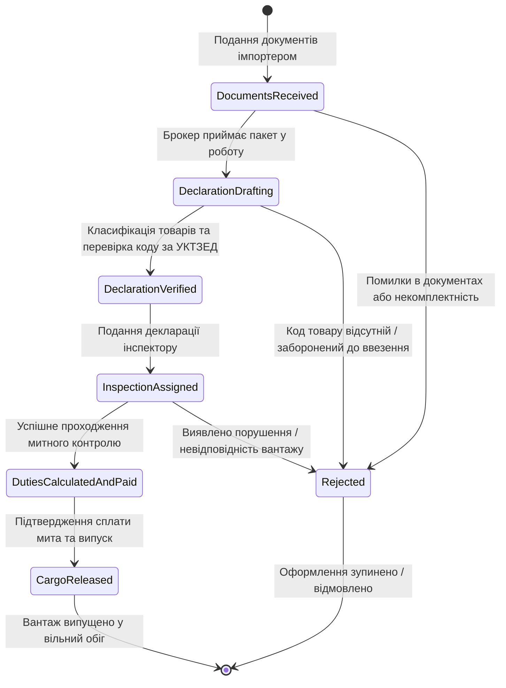

# Модель предметної області (Data Model & Class Architecture)

**Feature**: `001-uml-domain-model` | **Дата**: 2026-10-02  
**Статус**: Затверджено (Phase 1)

Цей документ формалізує повну структуру об'єктної моделі предметної області системи автоматизації діяльності митного брокера для подальшого генерування діаграм класів, послідовності, станів, CRC-карток та наступної програмної реалізації на мові Java SE.

---

## 1. Реєстр сутностей та ієрархія класів

---

## 2. Детальний опис сутностей

### 2.1. `IDocumentPackageHandler` (Interface)
- **Призначення**: Задає поведінковий контракт для всіх сторін митного оформлення, які мають приймати, верифікувати або передавати пакети документів.
- **Методи**:
  - `+processDocumentPackage(pkg: DocumentPackage): boolean` — повертає `true`, якщо пакет документів прийнято та пройшов первинну валідацію.

### 2.2. `CustomsParticipant` (Abstract Class)
- **Призначення**: Базовий абстрактний клас учасника митних відносин (інкапсуляція загальних реквізитів і поведінки).
- **Реалізує**: `IDocumentPackageHandler`.
- **Поля**:
  - `#id: String` — унікальний ідентифікатор суб'єкта.
  - `#name: String` — повна назва або найменування юридичної/фізичної особи.
  - `#contactEmail: String` — контактна електронна адреса.
- **Конструктори**:
  - `+CustomsParticipant(id: String, name: String, contactEmail: String)`
- **Ключові методи**:
  - `+final getParticipantInfo(): String` — **неперевизначуваний метод** (FR-007), що повертає форматований рядок з ідентифікатором та найменуванням учасника.
  - `+abstract processDocumentPackage(pkg: DocumentPackage): boolean` — поліморфний абстрактний метод.

### 2.3. `Importer` (Concrete Class)
- **Призначення**: Суб'єкт зовнішньоекономічної діяльності (імпортер товару).
- **Наслідує**: `CustomsParticipant`.
- **Поля**:
  - `-taxId: String` — податковий номер (ЄДРПОУ або ІПН).
  - `-companyAddress: String` — юридична адреса підприємства.
- **Конструктори**:
  - `+Importer(id: String, name: String, contactEmail: String, taxId: String, companyAddress: String)`
- **Методи**:
  - `+processDocumentPackage(pkg: DocumentPackage): boolean` — перевірка комплектності документів перед відправкою брокеру.
  - `+submitDocuments(broker: CustomsBroker, pkg: DocumentPackage): void` — ініціювання подання пакета документів брокеру.

### 2.4. `CustomsBroker` (Concrete Class)
- **Призначення**: Ліцензований митний представник (брокер), що здійснює декларування вантажу.
- **Наслідує**: `CustomsParticipant`.
- **Поля**:
  - `-licenseNumber: String` — серія та номер ліцензії митного брокера.
  - `-brokerageFeeRate: double` — комісійна ставка за надання брокерських послуг.
- **Конструктори**:
  - `+CustomsBroker(id: String, name: String, contactEmail: String, licenseNumber: String, brokerageFeeRate: double)`
- **Методи**:
  - `+processDocumentPackage(pkg: DocumentPackage): boolean` — верифікація рахунків, контрактів та описів від імпортера.
  - `+createDeclaration(importer: Importer, pkg: DocumentPackage): CustomsDeclaration` — фабричний метод створення проекту декларації.
  - `+classifyItem(registry: CommodityCodeRegistry, item: DeclarationItem): boolean` — підбір та перевірка коду товару за класифікатором.
  - `+submitDeclaration(inspector: CustomsInspector, declaration: CustomsDeclaration): void` — передача сформованої декларації інспектору на митний пост.

### 2.5. `CustomsInspector` (Concrete Class)
- **Призначення**: Посадова особа митного органу (інспектор), яка здійснює митний контроль та випуск товарів.
- **Наслідує**: `CustomsParticipant`.
- **Поля**:
  - `-badgeNumber: String` — номер особистого жетона / особистої номерної печатки (ОНП).
  - `-customsPostCode: String` — класифікаційний код підрозділу митного оформлення.
- **Конструктори**:
  - `+CustomsInspector(id: String, name: String, contactEmail: String, badgeNumber: String, customsPostCode: String)`
- **Методи**:
  - `+processDocumentPackage(pkg: DocumentPackage): boolean` — формальна перевірка дозвільних документів та сертифікатів.
  - `+assignInspection(declaration: CustomsDeclaration): String` — вибір форми контролю (документальний контроль, рентген, фізичний догляд).
  - `+verifyDocuments(declaration: CustomsDeclaration): boolean` — перевірка відповідності задекларованих відомостей поданим документам.
  - `+releaseCargo(declaration: CustomsDeclaration): boolean` — прийняття рішення про завершення митного оформлення та надання дозволу на випуск товару у вільний обіг.

### 2.6. `CustomsDeclaration` (Concrete Class)
- **Призначення**: Митна декларація — центральний юридичний та фінансовий документ оформлення.
- **Поля**:
  - `-declarationNumber: String` — унікальний реєстраційний номер декларації (наприклад, `UA100010/2026/000123`).
  - `-importerId: String` — ідентифікатор імпортера.
  - `-brokerId: String` — ідентифікатор брокера.
  - `-status: String` — поточний стан життєвого циклу.
  - `-items: List<DeclarationItem>` — список товарних позицій (композиція).
  - `-totalCustomsValue: double` — сумарна митна вартість усіх товарних позицій.
  - `-totalCalculatedDuty: double` — нарахована сума мита та зборів.
  - `-dutyPaid: boolean` — ознака повної сплати нарахованих митних платежів.
- **Конструктори**:
  - `+CustomsDeclaration(declarationNumber: String, importerId: String, brokerId: String)`
- **Методи**:
  - `+addItem(item: DeclarationItem): void` — додавання позиції до декларації з перерахунком сумарної митної вартості.
  - `+calculateDuties(rate: double): double` — **перевантажений метод 1** (FR-009): базовий розрахунок мита за ставкою `rate` від загальної вартості.
  - `+calculateDuties(rate: double, preferentialDiscount: double): double` — **перевантажений метод 2** (FR-009): розрахунок мита з урахуванням преференційної ставки або знижки за угодами про вільну торгівлю.
  - `+validateCommodityCodes(registry: CommodityCodeRegistry): boolean` — перевірка кодів усіх позицій через реєстр.
  - `+markDutiesPaid(): void` — фіксація успішного надходження платежів.
  - `+updateStatus(newStatus: String): void` — зміна статусу декларації.

### 2.7. `DeclarationItem` (Concrete Class)
- **Призначення**: Товарна позиція митної декларації.
- **Зв'язок**: Нерозривна композиція з `CustomsDeclaration` (`CustomsDeclaration *-- DeclarationItem`).
- **Поля**:
  - `-itemNumber: int` — порядковий номер позиції (1, 2, ...).
  - `-description: String` — детальний комерційний опис товару.
  - `-commodityCode: String` — 10-значний код УКТЗЕД.
  - `-invoiceValue: double` — вартість згідно з комерційним інвойсом.
  - `-netWeightKg: double` — вага нетто (кг).
  - `-originCountry: String` — країна походження (ISO 2-літерний код).
- **Конструктори**:
  - `+DeclarationItem(itemNumber: int, description: String, commodityCode: String, invoiceValue: double, netWeightKg: double, originCountry: String)`
- **Методи**:
  - `+getItemDetails(): String` — форматований опис товарної підгрупи.

### 2.8. `CommodityCodeRegistry` (Concrete Class)
- **Призначення**: Довідник Української класифікації товарів зовнішньоекономічної діяльності (УКТЗЕД).
- **Зв'язок**: Залежність (`CustomsDeclaration ..> CommodityCodeRegistry`).
- **Поля**:
  - `-tariffRates: Map<String, Double>` — відповідність кодів ставкам мита.
  - `-requiredPermits: Map<String, List<String>>` — перелік нетарифних обмежень та дозвільних документів.
- **Конструктори**:
  - `+CommodityCodeRegistry()`
- **Методи**:
  - `+getTariffRate(code: String): double` — повертає ставку ввізного мита для коду.
  - `+validateCodeFormat(code: String): boolean` — перевірка валідності формату коду (10 цифр).
  - `+getRequiredPermits(code: String): List<String>` — перелік сертифікатів або ліцензій.

---

## 3. Матриця типів взаємозв'язків між сутностями (FR-010)

| Тип зв'язку UML | Стрілка в Mermaid | Суб'єкт 1 | Суб'єкт 2 | Бізнес-зміст зв'язку |
|---|---|---|---|---|
| **Наслідування** (*Inheritance*) | `<|--` | `CustomsParticipant` | `Importer` | Імпортер є спеціалізацією учасника митних відносин |
| **Наслідування** (*Inheritance*) | `<|--` | `CustomsParticipant` | `CustomsBroker` | Брокер є спеціалізацією учасника митних відносин |
| **Наслідування** (*Inheritance*) | `<|--` | `CustomsParticipant` | `CustomsInspector` | Інспектор є спеціалізацією учасника митних відносин |
| **Реалізація** (*Realization*) | `<|..` | `IDocumentPackageHandler` | `CustomsParticipant` | Учасник митних відносин реалізує інтерфейс обробника пакетів документів |
| **Композиція** (*Composition*) | `*--` | `CustomsDeclaration` | `DeclarationItem` | Товарна позиція існує виключно в межах декларації та знищується разом із нею |
| **Залежність** (*Dependency*) | `..>` | `CustomsDeclaration` | `CommodityCodeRegistry` | Декларація звертається до реєстру для валідації кодів та розрахунку ставок |

---

## 4. Життєвий цикл та стани системи (State Transitions)

---

## 5. Дотримання принципів SOLID

1. **Single Responsibility Principle (SRP)**:
   - `CustomsDeclaration` відповідає за стан та цілісність декларації.
   - `DeclarationItem` відповідає виключно за параметри конкретного товару.
   - `CommodityCodeRegistry` відповідає лише за довідкову класифікацію та ставки.
   - Учасники (`Importer`, `CustomsBroker`, `CustomsInspector`) відокремлені за ролями.
2. **Open/Closed Principle (OCP)**:
   - Нові ролі учасників (наприклад, `Carrier` — перевізник, `BankRepresentative` — банк) можуть наслідувати `CustomsParticipant` без зміни коду існуючих класів.
3. **Liskov Substitution Principle (LSP)**:
   - Будь-який із класів `Importer`, `CustomsBroker`, `CustomsInspector` може підставлятися скрізь, де очікується `CustomsParticipant` або `IDocumentPackageHandler`.
4. **Interface Segregation Principle (ISP)**:
   - Інтерфейс `IDocumentPackageHandler` містить лише метод `processDocumentPackage`, не змушуючи класи реалізовувати зайві невластиві функції.
5. **Dependency Inversion Principle (DIP)**:
   - Залежності передаються через параметри методів та конструкторів (Constructor/Method Injection). Відсутні статичні зв'язки з глобальним станом.
